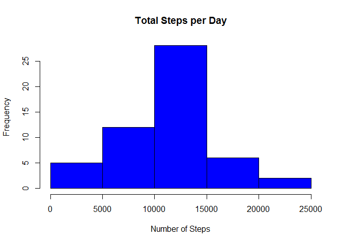
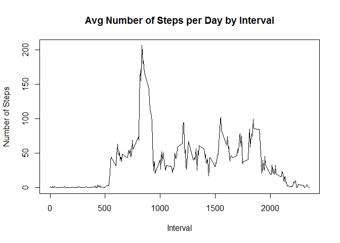

# Reproducible Research: Peer Assessment 1
Christian Willig  
August 2015

## Loading and preprocessing the data
In order to process the data I downloaded the file and load the data into a dataframe `data`.

```r
#creating temporary location for the file to be downloaded
temp <- tempfile()
urlfile <- "http://d396qusza40orc.cloudfront.net/repdata%2Fdata%2Factivity.zip"

#Downloading the file
download.file(urlfile,temp, mode="wb")

#Un compressing the file into the temporary location
unzip(temp)
unlink(temp)

#creating dataframe with the activity data
data <- read.csv("activity.csv")

#making sure date behaves as a date
data <- transform(data, date = as.Date(date))
```


## What is the mean total number of steps taken per day?
For this part of the assignment, you can ignore the missing values in the dataset.  
1. Make a histogram of the total number of steps taken each day  
2. Calculate and report the mean and median total number of steps taken
per day  


```r
#ignoring missing values
data_df2 <- na.omit(data)

#Calculate total steps during a day
total_steps_day <- aggregate(steps ~ date, data_df2, sum)

#Draw histogram with the total steps during a day
hist(total_steps_day$steps, main = paste("Total Steps per Day"), col="blue", xlab="Number of Steps")
```

 

```r
#Calculate median and mean
mean_steps_per_day <- mean(total_steps_day$steps)
median_steps_per_day <- median(total_steps_day$steps)
```

The `mean` of total number of steps per day is 10766.19

The `median` of total number of steps per day is 10765

## What is the average daily activity pattern?
1. Make a time series plot (i.e. type = "l") of the 5-minute interval (x-axis)
and the average number of steps taken, averaged across all days (y-axis)  


```r
steps_by_interval <- aggregate(steps ~ interval, data_df2, mean)

plot(steps_by_interval$interval,steps_by_interval$steps, type="l", xlab="Interval", ylab="Number of Steps",main="Avg Number of Steps per Day by Interval")
```

 

2. Which 5-minute interval, on average across all the days in the dataset,
contains the maximum number of steps?  


```r
max_number_of_steps <- steps_by_interval[which.max(steps_by_interval$steps),1]
```
The 4 minute interval that contains the maximum number of steps is 835

## Imputing missing values


## Are there differences in activity patterns between weekdays and weekends?
